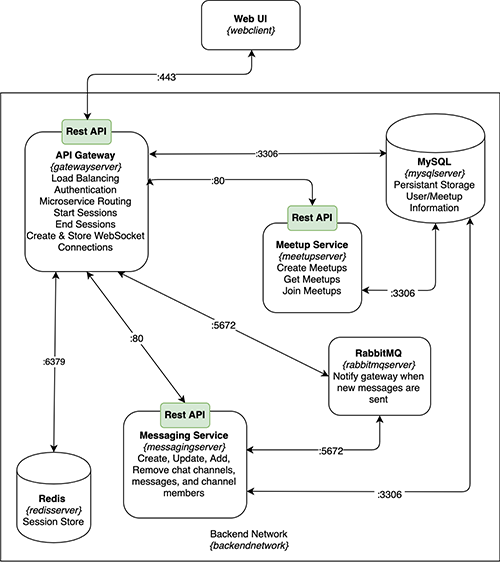

# Music Maker Meetup

[Hawk Ticehurst](https://hawkticehurst.com), [Stanley Wu](https://github.com/s711258w), [Pierce Cave](https://github.com/piercecave)

University of Washington, INFO 441: Server-Side Development Final Project

## Project Description

The aim of this project was to build a platform that enables the creation of meetup events and facilitates communication between musicians who enjoy playing music together.

It can be sometimes difficult for musicians to find other players with similar interests. As a result this platform will allow users to post public meetup events and message other users within the context of a specific event.

As developers, we were intrigued by the technical challenge that live-messaging using WebSockets and RabbitMQ presents.

## Technical Description

### Infrastructure

Users interact exclusively with our Web UI NGINX Docker container––hosted on an AWS EC2 instance. The web interface container interacts with our backend docker network––hosted on a separate EC2 instance. 

The API Gateway Service, accessed via a REST API on port 443, is the singular entry point of our backend. The Gateway Service is predominantly responsible for authenticating users, facilitating communication with all the other microservices in our backend, and creating and storing active WebSocket connections for each user who has a chat open. New user data created by this service is stored using the MySQL database, accessed on port 3306. New session data is stored in the Redis database, accessed on port 6379.

The Meetup Service, accessed via a REST API on port 80, is responsible for handling the creation and distribution of meetup events. Additionally, it allows users to join specific events. New meetup data created by this service is stored using the MySQL database, accessed on port 3306.

The Messaging Service, accessed via a REST API on port 80, is responsible for creating, updating, adding, and removing chat channels, chat messages, and channel members. New chat data created by this service is stored in the MySQL database, accessed on port 3306. When a new chat message is created the RabbitMQ container, accessed on port 5672, is used to notify the API Gateway of the event which in turn will write the newly created message to every live WebSocket connection associated with the channel the chat message was sent to.

### Service Architecture



```Note: Labels formatted as {somename} are used to identify the Docker container name or Docker network name of each component in the above architectural diagram.```

### User Stories

| **Priority** | **User** | **Description** |
|--------------|----------|-----------------|
| P0 (High) | As a user | I want to be able to create a user account and log in |
| P0 (High) | As a user | I want to create public meetup events that other music players can discover |
| P0 (High) | As a user | I want to be able to view meetup events that other users have created |
| P0 (High) | As a user | I want to chat with other music players to plan meetups and discuss music together |
| P1 (Med) | As a user | I want to be able to join meetup events that have already been created |


**Story #1: I want to be able to create a user account and log in**

We created a **Dockerized** **Go** web microservice that acts as an API gateway. This web service exposes a REST API (over port 443) that the Web UI can call. This gateway facilitates user account creation and authentication.

The service maintains a connection to our **MySQL** database (over port 3306) in order to save user information. The service also maintains a connection to our **Redis** database (over port 6379) in order to create, track, and delete user sessions.

**Story #2: I want to create public meetup events that other music players can discover**

We created a **Dockerized** **Node.js** web microservice for creating meetup events. This web service exposes a REST API (over port 80) that the API Gateway can call.

The service maintains a connection to our **MySQL** database (over port 3306) in order to store meetup information.

**Story #3: I want to be able to view meetup events that other users have created**

 This is an augmentation to the above **Dockerized** **Node.js** web microservice that retrieves all meetup events from our **MySQL** database (over port 3306) and returns them to the client to be displayed via the Web UI.

**Story #4: I want to chat with other music players to plan meetups and discuss music together**

We created a **Dockerized** **Node.js** web microservice to facilitate messaging between users. This web service exposes a REST API (over port 80) that the API Gateway can call. This messaging service maintains a connection to our **MySQL** database (over port 3306) to store messaging history.

When a new message is created, this microservice notifies a **RabbitMQ** queue of this event. The new message event is consumed by the API Gateway and writes the contents of the new message to every live WebSocket connection that is associated with the channel the chat message was sent to.

**Story #5: I want to be able to join meetup events that are already created**

This is a further augmentation to our **Dockerized** **Node.js** Meetup microservice. We implemented a REST API PATCH update that will add the user to the given meetup.

The service maintains a connection to our **MySQL** database (over port 3306) in order to store and update this information.

## API Endpoints

```/v1/users```
- ```POST```: Create a new user account
    - ```201```: Created a new user
    - ```401```: Could not create user, or invalid session
    - ```415```: Client did not use JSON in request
    - ```500```: Server error

```/v1/users/{userid | me}```
- ```GET```: Get user information
    - ```200```: Returns ```application/json``` copy of the user information
    - ```401```: Could not retrieve user, or invalid session
    - ```404```: Specified user not found
    - ```500```: Server error

```/v1/users/me```
- ```PATCH```: Update the currently authenticated user information
    - ```200```: Returns ```application/json``` copy of the updated user information
    - ```403```: Invalid user id
    - ```415```: Client did not use JSON in request
    - ```500```: Server error

```/v1/sessions```
- ```POST```: Create a new user session (i.e. user log in)
    - ```201```: Created a new session
    - ```401```: Could not create a new session
    - ```500```: Server error

```/v1/sessions/mine```
- ```DELETE```: Delete the given user session (i.e. user log out)
    - ```200```: Deleted the given session
    - ```401```: Could not delete the given session
    - ```500```: Server error

```/v1/ws```
- Create a new websocket connection

```/v1/events```
- ```GET```: Get all meetup events
    - ```201```: Returns ```application/json``` list of all events
    - ```401```: Could not retreive events
    - ```500```: Server error
- ```POST```: Create a new meetup event
    - ```201```: Created new meetup event
    - ```401```: Could not create new meetup event
    - ```500```: Server error

```/v1/events/join```
- ```GET```: Get information about events that the logged in user has joined
    - ```201```: Returns ```application/json``` list of event chat channels the user is a member of
    - ```401```: Could not get list of channels the user has joined
    - ```500```: Server error
- ```POST```: Joins the logged in user to the given event
    - ```201```: Joins the user to the given event
    - ```401```: Could not join the user to the event
    - ```500```: Server error

```/v1/channels```
- ```GET```: Get a list of all chat channels
    - ```200```: Returns ```application/json``` list of all chat channels
    - ```401```: User not authenticated
    - ```500```: Server error
- ```POST```: Create a new chat channel
    - ```201```: Returns ```application/json``` copy of the new channel
    - ```401```: User not authenticated
    - ```500```: Server error

```/v1/channels/{channelid}```
- ```GET```: Get the 100 most recent chat messages for the given channel
    - ```200```: Returns ```application/json``` list of the 100 most recent chat messages for the given channel
    - ```400```: Missing path parameter
    - ```401```: User not authenticated
    - ```403```: User is not a member of the given channel
    - ```500```: Server error
- ```POST```: Create a new message for the given channel
    - ```201```: Returns ```application/json``` copy of the new message
    - ```400```: Missing path parameter
    - ```401```: User not authenticated
    - ```403```: User is not a member of the given channel
    - ```500```: Server error
- ```PATCH```: Update the given channel
    - ```200```: Returns ```application/json``` copy of the updated channel
    - ```400```: Channel name or description was not provided in request body or missing path parameter
    - ```401```: User not authenticated
    - ```403```: User is not the creator of the given channel
    - ```500```: Server error
- ```DELETE```: Delete the given channel
    - ```200```: Returns ```text/plain``` message confirming the channel was successfully deleted
    - ```400```: Missing path parameter
    - ```401```: Could not join the user to the event or user not authenticated
    - ```403```: User is not the creator of the given channel
    - ```500```: Server error

```/v1/channels/{channelid}/members```
- ```POST```: Adds the given user to the given channel
    - ```201```: Returns ```text/plain``` message confirming the user was successfully added
    - ```400```: Missing path parameter
    - ```401```: User not authenticated
    - ```403```: User is not the creator of the given channel
    - ```500```: Server error
- ```DELETE```: Removes the given user from the given channel
    - ```200```: Returns ```text/plain``` message confirming the user was successfully removed
    - ```400```: Missing path parameter
    - ```401```: User not authenticated
    - ```403```: User is not the creator of the given channel
    - ```500```: Server error

```/v1/messages/{messageid}```
- ```PATCH```: Update the given chat message
    - ```200```: Returns ```application/json``` copy of the updated message
    - ```400```: Missing path parameter
    - ```401```: User not authenticated
    - ```403```: User is not the creator of the given message
    - ```500```: Server error
- ```DELETE```: Delete the given chat message
    - ```200```: Returns ```text/plain``` message confirming the message was successfully deleted
    - ```400```: Missing path parameter
    - ```401```: User not authenticated
    - ```403```: User is not the creator of the given message
    - ```500```: Server error

## Database Schemas

We will use MySQL as our persistent database.

Users: User represents a person who can log-in, message, and be a part of meetups on our site
```
CREATE TABLE IF NOT EXISTS Users (
    ID INT NOT NULL AUTO_INCREMENT,
    Email VARCHAR(255) NOT NULL UNIQUE,
    PassHash VARCHAR(72) NOT NULL,
    UserName VARCHAR(255) NOT NULL UNIQUE,
    FirstName VARCHAR(128),
    LastName VARCHAR(128),
    PhotoURL VARCHAR(2083) NOT NULL,
    PRIMARY KEY (ID)
);
```

Events: Represents an event that multiple users can join
```
CREATE TABLE IF NOT EXISTS Events (
    ID INT NOT NULL AUTO_INCREMENT,
    Title VARCHAR(255) NOT NULL,
    EventDateTime VARCHAR(255) NOT NULL,
    ChannelID INT NOT NULL,
    LocationOfEvent VARCHAR(255) NOT NULL,
    DescriptionOfEvent VARCHAR(255) NOT NULL,
    PRIMARY KEY (ID),
    FOREIGN KEY (ChannelID) REFERENCES Channels(ID)
);
```

Channels: Represents a chat channel
```
CREATE TABLE IF NOT EXISTS Channels (
    ID INT NOT NULL AUTO_INCREMENT,
    ChannelName VARCHAR(255) NOT NULL,
    ChannelDescription VARCHAR(255),
    PrivateChannel BOOLEAN NOT NULL,
    TimeCreated DATETIME NOT NULL,
    Creator INT,
    LastUpdated DATETIME,
    PRIMARY KEY (ID)
);
```

Messages: Represents a user created chat message
```
CREATE TABLE IF NOT EXISTS Messages (
    ID INT NOT NULL AUTO_INCREMENT,
    ChannelID INT NOT NULL,
    Body VARCHAR(255) NOT NULL,
    TimeCreated DATETIME NOT NULL,
    Creator INT NOT NULL,
    LastUpdated DATETIME,
    PRIMARY KEY (ID)
);
```
