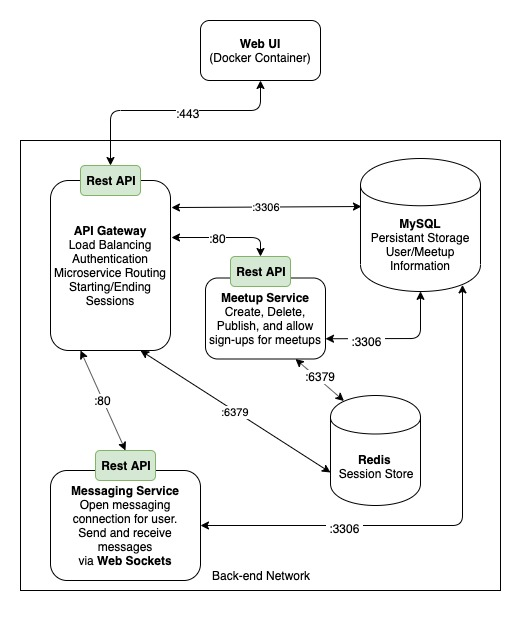

# INFO 441 Final Project Proposal

## Project Description

Our target audience is people who want to play music in a group. We want to build a platform in which people can find others to form music ensembles and enjoy playing music together. 

It can be hard for people playing an instrument to find people playing similar instruments, or an ensemble/band may be looking for a certain player to join their group (Ex: Jazz band needs a bass player). This platform will allow people to post public meetup events and message other players. This platform will also allow users to learn from other players nearby to them.

As developers, we are intrigued by the challenge that live-messaging with web sockets presents. We are also interested to see how connecting users chatting with actual meetup capabilities will go, how seamless we can make the transition.

## Technical Description

### Infrastructure

Users will interact exclusively with our website/domain container, hosted by AWS, and that (Docker) container will interact with our web server handlers. In our backend, user/meetup information will be stored in a MySQL database, and session information will be stored in a Redis database. Between our Web UI and our session information wel will have a Gateway setup, and this will interact with the Web UI using a REST API. 



| **Priority** | **User** | **Description** |
|--------------|----------|-----------------|
| P0 (High) | As a user | I want to be able to create a user account and log in |
| P0 (High) | As a user | I want to create public meetup events that other music players can discover |
| P0 (High) | As a user | I want to be able to view meetup events that other users have created |
| P0 (High) | As a user | I want to chat with other music players to plan meetups and discuss music together |
| P1 (Med) | As a user | I want to be able to join meetup events that are already created |

**Story #1: I want to be able to create a user account and log in**

We will create a **Dockerized** **Go** web microservice that acts as the server gateway. This web service will expose a REST API over port 443 that the Web UI can call. This gateway will facilitate user creation and authentication. 

The service will maintain a connection to our **MySQL** database over port 3306 in order to save user information. The service will also maintain a connection to our **Redis** database over port 6379 in order to create, track, and delete user sessions.

**Story #2: I want to create public meetup events that other music players can discover**

We will create a **Dockerized** **Go** web microservice for creating, storing, and deleting meetup events. This web service will expose a REST API over port 80 that the API Gateway can call. 

The service will maintain a connection to our **MySQL** database over port 3306 in order to store meetup information.

**Story #3: I want to be able to view meetup events that other users have created**

As a continuation of the previous Go web 

**Story #4: I want to chat with other music players to plan meetups and discuss music together**

We will create a **Dockerized** **Node.js** web microservice to facilitate messaging between users. This web service will expose a REST API over port 80 that the API Gateway can call. This messaging service will be powered via **Web Sockets** and maintain a connection to our **MySQL** persistent database over port 3306 to maintain messaging history.

**Story #5: I want to be able to join meetup events that are already created**

This will be an update to our Meetup web microservice. That will implement a REST API PATCH update to add the user to the meetup.

The service will maintain a connection to our **MySQL** database over port 3306 in order to store and update this information.

## API Endpoints

/v1/meetups/    (Homepage)
* GET: Respond with a cardview of public meetups that users want to organize, only viewable if signed in
- 200: Retrieve and return all meetups information
- 401: No sessionID or user not logged in
- 500: Server error

/v1/meetups/{meetupID}    (Meetup page)
* GET: Respond with a struct with info on the given meetup
- 200: Retrieve and return all the meetup's information
- 401: No sessionID or user not logged in
- 500: Server error
* DELETE: delete meetup event, only user who created meetup event can delete meetup event
- 200: Retrieve and return all meetups information
- 401: No sessionID or user not logged in
- 500: Server error

/v1/user/signin
* POST: gets the sign in page
- 200: Authenticate and log user in
- 401: Cannot sign in given credentials
- 500: Server error
* DELETE: sign user out
- 200: Successfully sign out user and let the user know with message
- 401: Session error, potentially no one logged in or distorted session
- 500: Server error

/v1/user/signup
* POST: post information to user database to create user account
- 200: Retrieve new user information
- 401: Could not create user, or invalid session
- 500: Server error

/v1/meetups/newmeetup
* POST: post new meetup event to meetup database associated with user
- 200: Post info to MySQL database, return meetup id
- 401: Invalid session
- 500: Server error

/v1/user/chat/
* GET: get chat page 
- 200: Retrieve and return chat page
- 401: No sessionID or user not logged in
- 500: Server error

### Database Schemas

We will use MySQL as our persistent database.

user: User represents a person who can log-in, message, and be a part of meetups on our site
```
{
    'email': 'user_email',
    'passwordhash': 'password_hash',
    'username': 'username',
    'datesignedup': 'date'

}
```

credentials: Represents what a user will input to log in to their account
```
{
    'email': 'user_email',
    'password': 'password'

}
```

meetup: Represents a proposed or completed meetup between multiple users at a certain location for a certain activity
```
{
    'userlist': [
        'user1'
    ],
    'location': 'address',
    'creator': 'username',
    'date': 'date',
    'starttime': 'starttime',
    'endtime': 'endtime'
}
```

